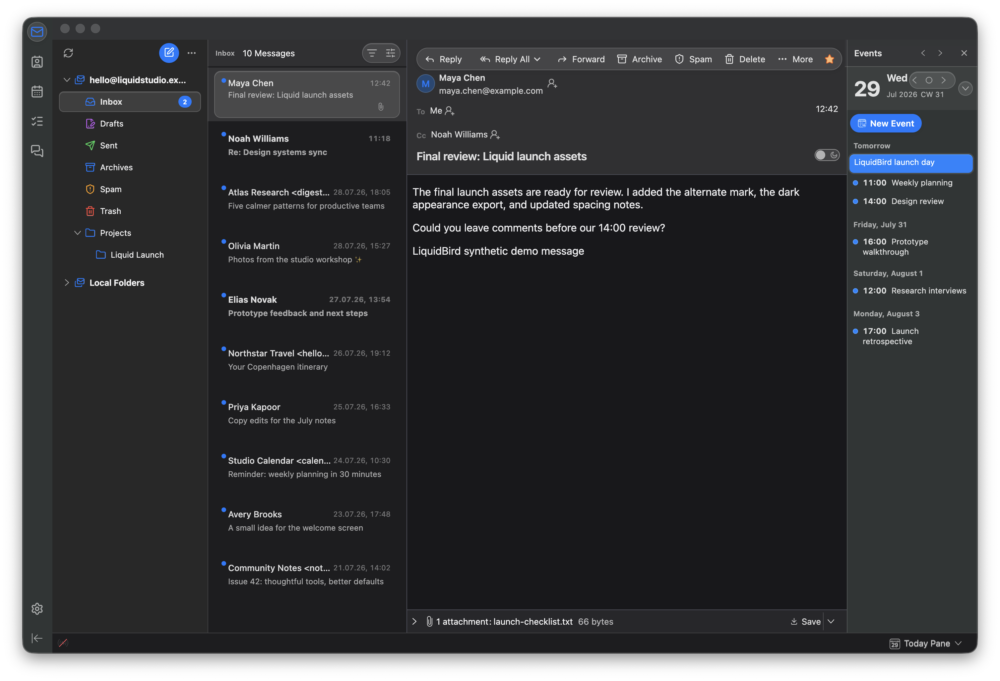
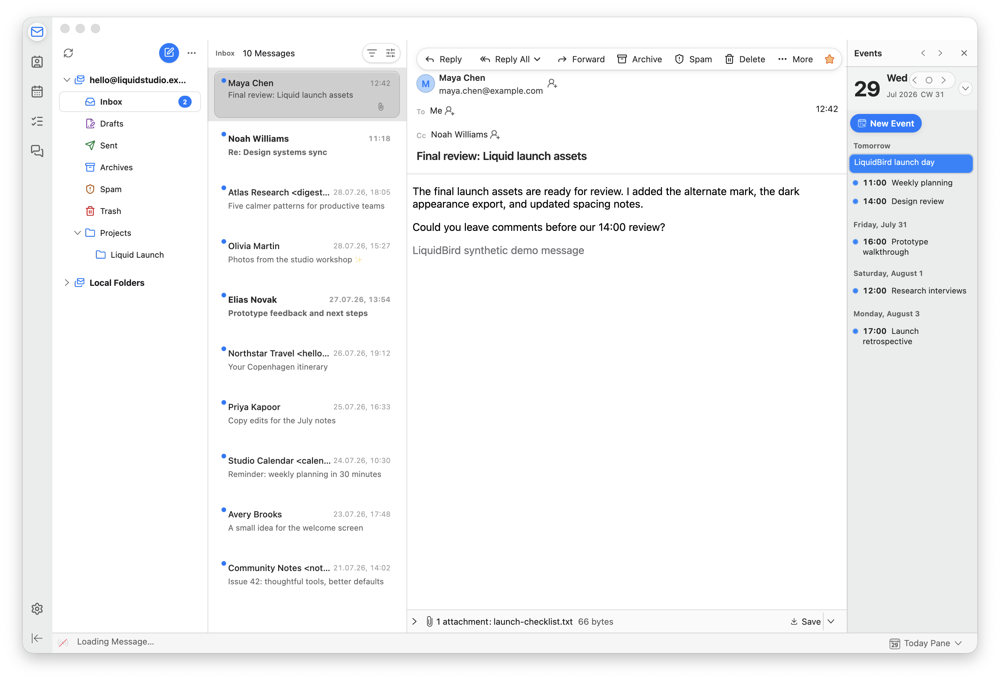
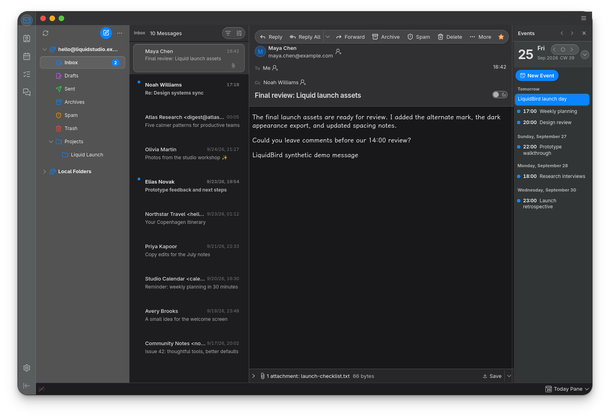
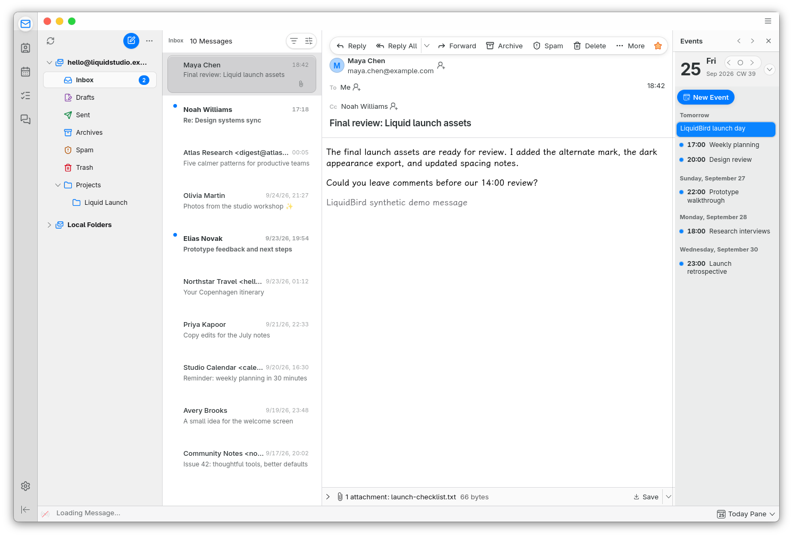

# LiquidBird

LiquidBird is an independent Liquid Glass theme for Mozilla Thunderbird,
originally built for macOS 27 and now adapted for Linux with niri. It preserves
Thunderbird's mail, calendar, tasks, contacts, chat, compose, settings,
account-settings, and add-ons functionality.

| Dark appearance | Light appearance |
| --- | --- |
|  |  |

These are captures of the real theme running in Thunderbird Beta. The profile,
mail, contacts, and calendar entries are generated synthetic fixtures and
contain no personal mailbox data.

The Linux/niri port was also captured with Thunderbird 156.0 in an isolated
Wayland profile on 2026-09-25:

| Linux/niri dark | Linux/niri light |
| --- | --- |
|  |  |

On macOS, LiquidBird uses Thunderbird's native Gecko/AppKit appearance hooks
for the window titlebar and sidebar. On Linux, its platform layer makes the
sidebar transparent so a compatible niri build can blur the background. The
macOS theme follows the Mac's appearance, accent color, increased-contrast
setting, reduced-transparency setting, and reduced-motion preference.

## Highlights

- Native macOS sidebar and titlebar vibrancy where Gecko exposes it
- Linux/niri sidebar transparency with compositor background blur
- macOS 27-style concentric corners, segmented toolbar groups, and restrained glass
- Physical press feedback on interactive glass controls
- Native focused/inactive selection states and semantic toggle treatment
- System accent color on macOS; screenshot-matched blue on Linux (customizable in `custom.css`)
- Light/dark appearance, density choices, and accessibility adaptations
- Complete replacement glyph set from the freely redistributable Lucide set
- Styling for mail folders, message lists and readers, search, quick filter,
  compose, contacts, calendar, tasks, chat, dialogs, settings, account settings,
  and add-ons
- `custom.css` for update-safe personal overrides

## Compatibility

The original LiquidBird 0.1.0 was manually exercised with Thunderbird Beta
154.0 (build 15426.7.21) on macOS 27. The Linux/niri adaptation was developed
with Thunderbird 156.0 on native Wayland. Linux needs compositor blur for the
translucent background shown in the [Linux setup guide](docs/LINUX.md);
non-macOS platforms cannot use native AppKit materials. Other Thunderbird
versions and compositors remain best-effort.

Thunderbird can rename its internal selectors in any update. Consult the
[tested configuration matrix](docs/COMPATIBILITY.md) and
[coverage notes](docs/COVERAGE.md) before reporting a problem.

> [!IMPORTANT]
> Thunderbird does not officially support `userChrome.css` or
> `userContent.css`. These customizations can stop working after an update and
> may complicate troubleshooting. Always keep a profile backup and know how to
> disable the theme.

## Install

For Linux with niri, follow the [Linux setup and removal guide](docs/LINUX.md).
The steps below describe the macOS installation.

Use a tagged release rather than downloading a moving development snapshot.
The release ZIP contains a ready-to-copy `chrome` directory.

1. In Thunderbird, open **Settings → General → Config Editor** and set
   `toolkit.legacyUserProfileCustomizations.stylesheets` to `true`.
2. Open **Help → Troubleshooting Information** and click **Show in Finder**
   next to **Profile Folder**.
3. Fully quit Thunderbird.
4. If the profile already contains a `chrome` directory, duplicate it and name
   the copy something such as `chrome.backup-2026-07-25`. Keep that backup
   outside the active `chrome` directory.
5. Copy `liquidbird.css`, `liquidbird-content.css`, and the complete `Icons` and
   `linux` directories from the release into the profile's `chrome` directory.
6. Configure the two loader files without overwriting existing customizations:

### `userChrome.css`

If the file does not exist, copy the release's `userChrome.css`. If it already
exists, keep it and add these imports at the very beginning, before every other
CSS rule:

```css
@import url("liquidbird.css");
@import url("linux/chrome.css");
@import url("linux/mail-layout.css");
@import url("linux/titlebuttons.css");
@import url("custom.css");
```

### `userContent.css`

If the file does not exist, copy the release's `userContent.css`. If it already
exists, keep it and add this import at the very beginning, before every other
CSS rule:

```css
@import url("liquidbird-content.css");
@import url("linux/content.css");
```

### `custom.css`

Never replace an existing `custom.css`. If the file does not exist, duplicate
`custom.css.example` from the release and rename the duplicate `custom.css`.
Keep personal rules only in that file.

7. Fully reopen Thunderbird.

The closest match uses Thunderbird's default density, card view, and vertical
view, but LiquidBird also contains rules for the other documented combinations.

## Updating

1. Back up the active `chrome` directory and fully quit Thunderbird.
2. Replace only `liquidbird.css`, `liquidbird-content.css`, `Icons`, and `linux`
   with the files from the new release.
3. Compare release loader files with your existing `userChrome.css` and
   `userContent.css`; merge import changes rather than overwriting either file.
4. Keep the existing `custom.css` unchanged.
5. Reopen Thunderbird and review the release notes for compatibility changes.

For example, a personal override belongs in `custom.css`:

```css
:root {
  --lb-radius-surface: 10px;
}
```

## Disable, roll back, or uninstall

To disable LiquidBird temporarily, fully quit Thunderbird and comment out the
LiquidBird imports in `userChrome.css` and `userContent.css`, then reopen
Thunderbird. Alternatively, set
`toolkit.legacyUserProfileCustomizations.stylesheets` to `false` to disable all
profile CSS customizations.

To roll back, fully quit Thunderbird, rename the active `chrome` directory,
restore the backup made during installation or update, and reopen Thunderbird.

To uninstall LiquidBird while retaining other custom CSS:

1. Fully quit Thunderbird.
2. Remove the LiquidBird import lines from `userChrome.css` and
   `userContent.css`.
3. Remove `liquidbird.css`, `liquidbird-content.css`, and the LiquidBird `Icons`
   and `linux` directories after confirming that no personal rules use them.
4. Keep or remove `custom.css` according to whether it contains personal work.
5. Reopen Thunderbird.

## Troubleshooting

1. Confirm the legacy-stylesheet preference is `true` and fully restart
   Thunderbird; closing only a tab or window is insufficient.
2. Confirm capitalization and placement: all CSS files and `Icons` must be
   directly inside the active profile's `chrome` directory.
3. Disable personal `custom.css` rules and other profile CSS temporarily.
4. Check whether the problem occurs with LiquidBird disabled. If it does, it is
   probably a Thunderbird or add-on issue rather than a LiquidBird issue.
5. Compare the exact Thunderbird version and configuration with
   [`docs/COMPATIBILITY.md`](docs/COMPATIBILITY.md).
6. Restore the backup if Thunderbird becomes difficult to use.
7. If the problem is LiquidBird-specific, read [SUPPORT.md](SUPPORT.md) and use
   the bug-report form with a sanitized screenshot.

Mozilla's own
[unsupported customization guidance](https://support.mozilla.org/en-US/kb/userchromecss-js-usercontent-unsupported)
contains additional reset and recovery information.

## Development

Run the repository checks before contributing:

```sh
python3 scripts/check.py
python3 -m unittest discover -s tests
```

Build the deterministic release archive using the version in `VERSION`:

```sh
python3 scripts/package_release.py --output dist
```

Generate an isolated, offline Thunderbird profile containing only synthetic
mail, contacts, and calendar data, then capture the themed application without
exposing a personal profile:

```sh
python3 scripts/demo.py capture
```

Regenerate and publish the two README screenshots:

```sh
python3 scripts/demo.py capture \
  --surface mail \
  --appearance both \
  --publish-readme
```

See the [synthetic screenshot workflow](docs/SCREENSHOTS.md) for selecting UI
surfaces, capturing light and dark appearances, and inspecting the demo safely.
For Linux/niri installation, configuration, and the material experiment, see
[the Linux guide](docs/LINUX.md) and [stage 1 findings](docs/LINUX_STAGE1.md).

See [CONTRIBUTING.md](CONTRIBUTING.md), [SUPPORT.md](SUPPORT.md),
[CHANGELOG.md](CHANGELOG.md), and [the release guide](docs/RELEASING.md) for
the contribution, support, and release processes.

## Design and licensing

Apple's macOS 27 design kit and Human Interface Guidelines are visual
references, but LiquidBird bundles no Apple Design Resource or SF Symbol. Apple's
design-resource license does not permit repackaging those assets as a theme.
The research and implementation rationale are in
[`docs/DESIGN.md`](docs/DESIGN.md).

Interface icons are unmodified Lucide SVG source files distributed under the
ISC license, with a subset also covered by Feather's MIT license. The Linux
title-button images come from the MIT-licensed MacTahoe GTK theme. FluentBird
was used as an MIT-licensed selector-coverage reference. Full notices and
pinned upstream revisions are in
[`THIRD_PARTY_NOTICES.md`](THIRD_PARTY_NOTICES.md).

LiquidBird itself is distributed under the [MIT License](LICENSE).

## Independence and trademarks

LiquidBird is an independent community project and is not affiliated with or
endorsed by Apple, Mozilla, MZLA, or the Thunderbird project. Apple, macOS,
Mozilla, and Thunderbird names and marks belong to their respective owners and
are used only to identify compatibility and design references.
